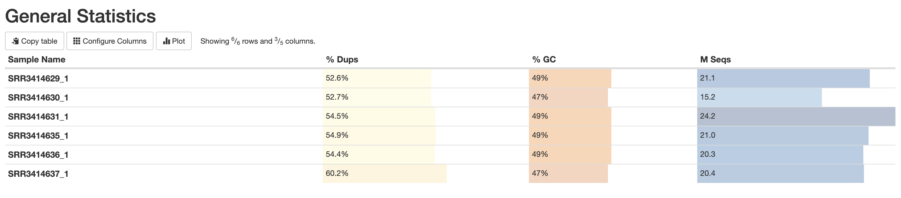
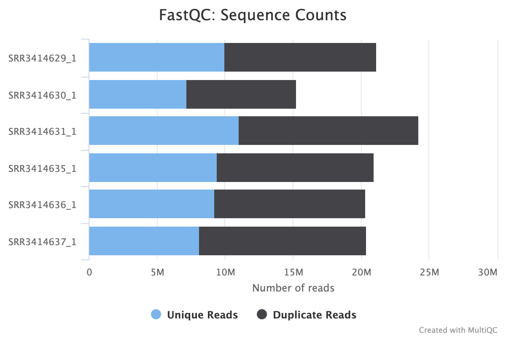
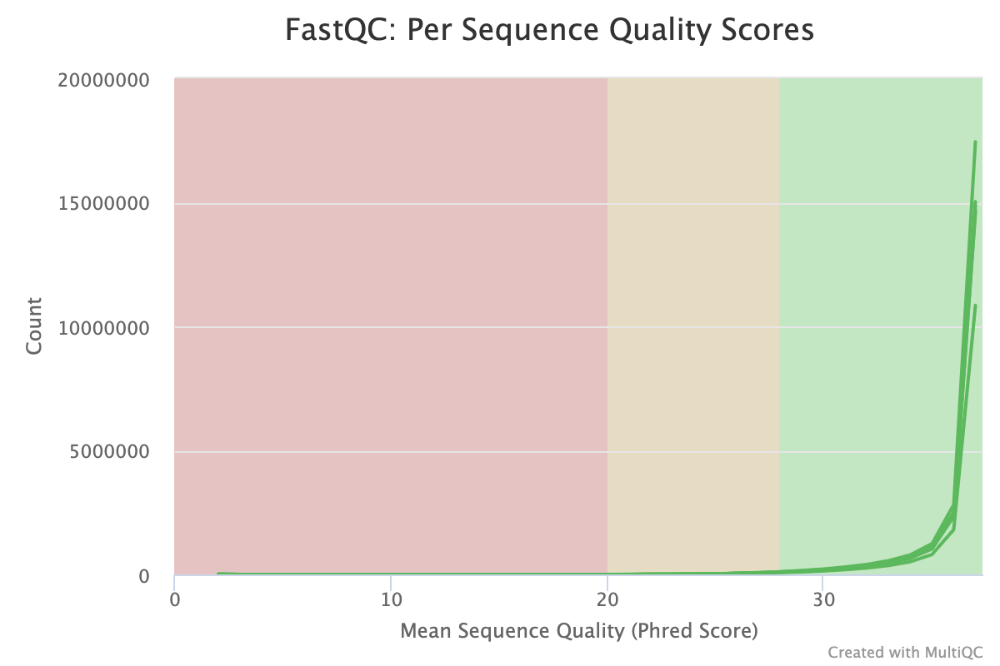
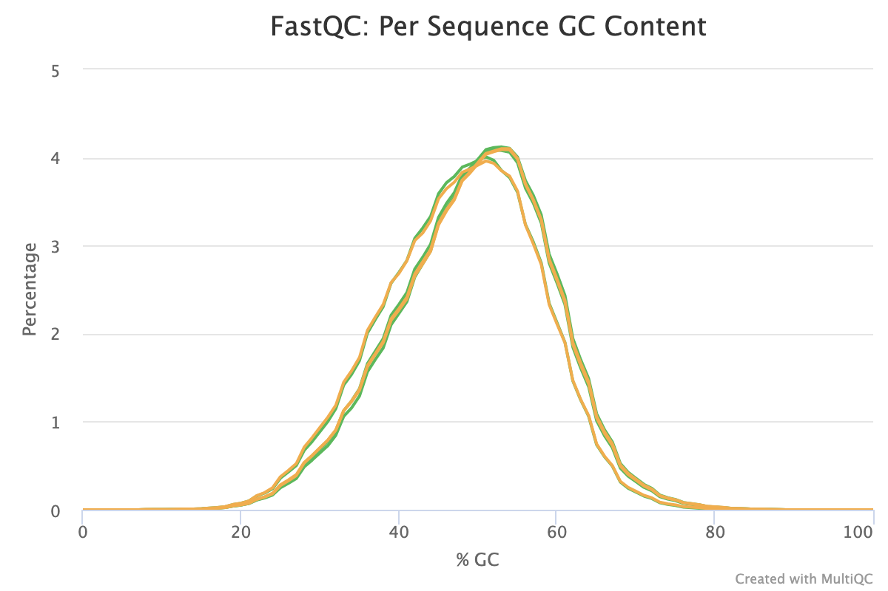
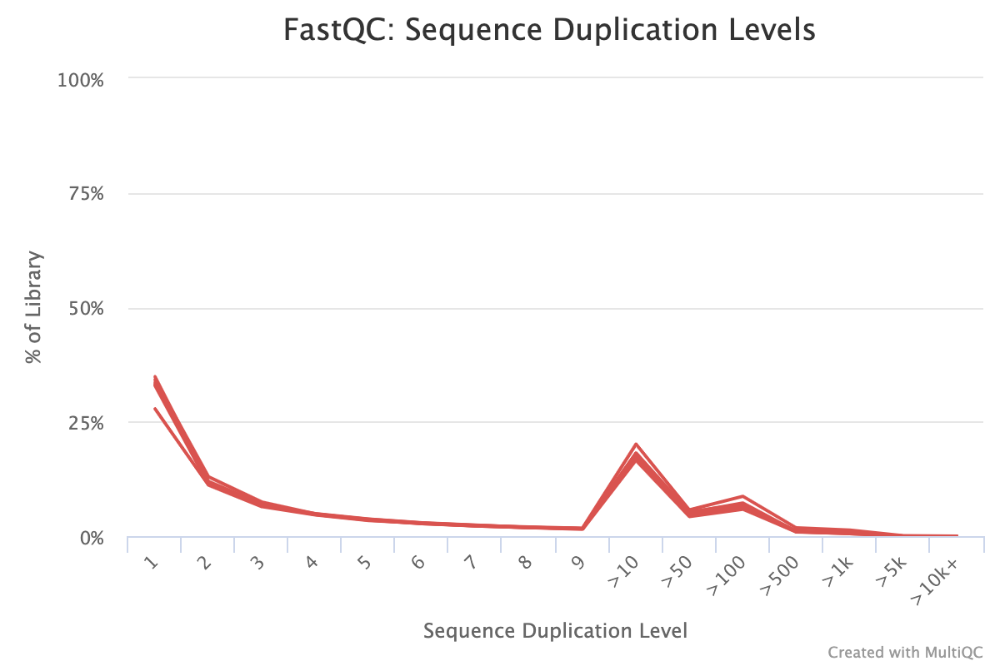
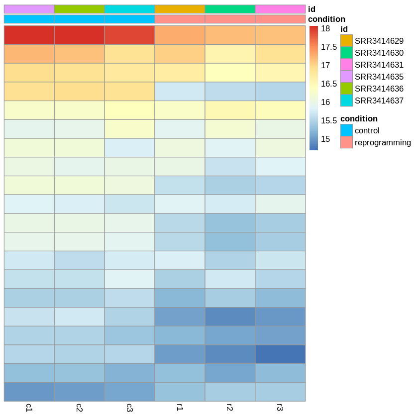
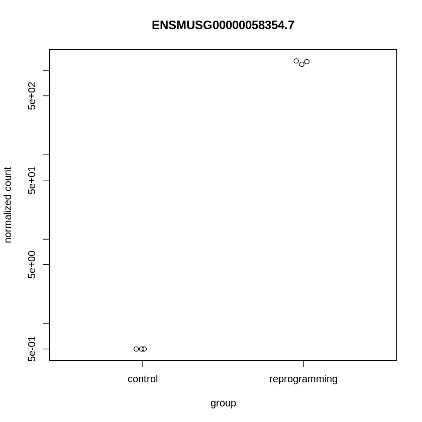
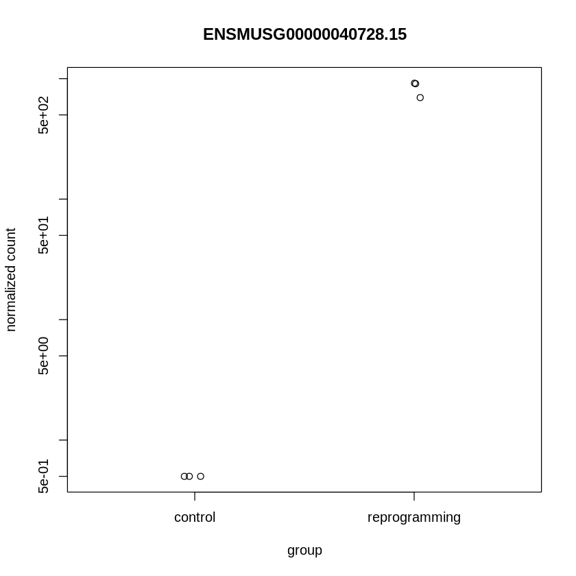

Ссылка на [колаб с основной частью задания](https://colab.research.google.com/drive/1nY90mkwKFuT7VxcXiWQl6McieN1AFx0y?usp=sharing)
Ссылка на [колаб с бонусной частью задания](https://colab.research.google.com/drive/1AF-Tp77cLE4JryQQbltniCA0kNcxxgc-?usp=sharing)

Из отчёта:

Графики для генов, которые поменяли свою экспрессию наиболее значимо:

