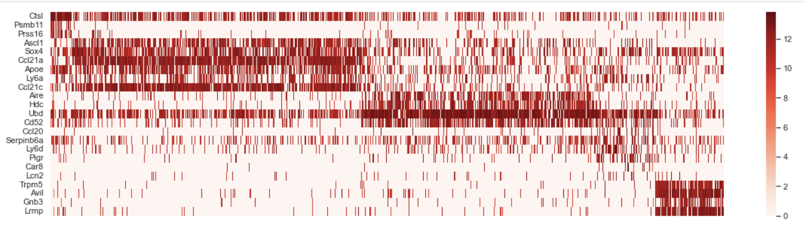
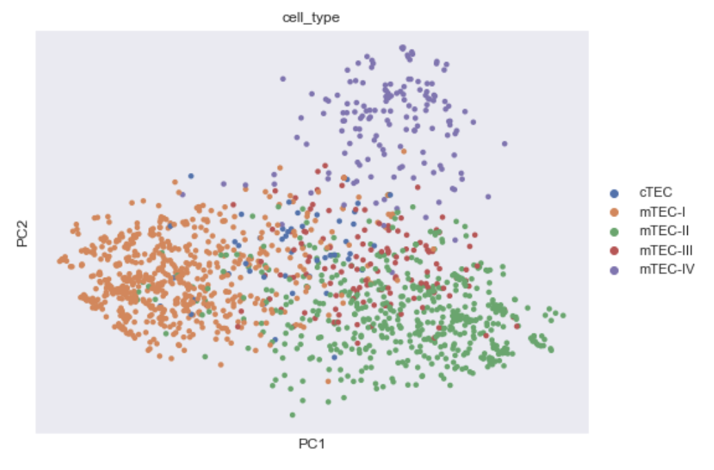

### Основная часть
В папке src – jupyter notebook с кодом.

Для того, чтобы нормализовать данные, я использовала метод TPM, но поскольку нам были неизвестны длины транскрипций, пришлось использовать модифицированный TPM:

$$
TPM_i = \frac{q_i}{\sum q_i} \cdot 10^6
$$

Получившаяся хитмапа:
 

Результаты PCA:

Результаты UMAP:

Выводы: кластеризация с понижением размерности через UMAP получилась лучше, чем через PCA – кластеры лучше различимы (и если посмотреть на разные метрики качества кластеризации, думаю, у UMAP тоже будут лучшие показатели)
